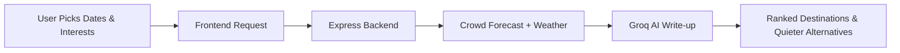

<div align="center">

# 🌍 TRAVELLOOP

### Plan smarter, travel quieter

<p align="center">
  
  
  
  
  
</p>

<p align="center">
  <a href="https://travelloop-82wr.vercel.app/">
    
  </a>
</p>

<br/>


### ✈️ Go where the crowds aren't

Tell Travelloop your dates and it finds the best places in India to visit, forecasts how crowded each one will be, suggests quieter alternatives, and helps you plan every day of the trip.

🔗 **Live:** [https://travelloop-82wr.vercel.app/](https://travelloop-82wr.vercel.app/)

</div>

---

# ✨ Features

<table>
<tr>
<td width="50%">

## 🧭 Date-Aware Suggestions
- Best places for **your** travel dates
- Crowd forecast (Low / Medium / High) with reasons
- Holidays, long weekends, festivals & school vacations
- Less crowded alternatives with the same feel
- "Better dates" tips and weather for your dates
- 65+ Indian destinations

</td>

<td width="50%">

## 🗺️ Trip Planning
- Day-by-day itinerary builder
- Budget tracking in ₹
- Packing list and trip notes
- Upcoming / previous trips, search & sort
- Share a read-only trip link (WhatsApp, email)

</td>
</tr>
<tr>
<td width="50%">

## 🔐 Accounts
- Email & password sign up / login
- **Continue with Google**
- Profile with trip stats and badges
- Change or set a password in Settings

</td>

<td width="50%">

## 🎨 Modern UI
- Tilted photo collage dashboard
- Sticky scroll animations
- Smooth Framer Motion transitions
- Responsive design for mobile & desktop

</td>
</tr>
</table>

---

# 🛠️ Tech Stack

<div align="center">

| Frontend | Backend | AI & Data |
|----------|----------|----|
| React 19 | Node.js | Groq API (Llama 3.3) |
| Vite | Express 5 | Crowd forecast engine |
| Tailwind CSS | MongoDB Atlas + Mongoose | Open-Meteo weather |
| Framer Motion | JWT + Google sign-in | Wikipedia images |

</div>

---

# 📂 Project Structure

```bash
Travelloop
│
├── Frontend
│   ├── src
│   │   ├── assets
│   │   ├── components
│   │   ├── pages          # CreateTrip, SharedTrip, Info pages, 404
│   │   ├── utils
│   │   ├── IntroPage.jsx  # landing page
│   │   ├── Signup.jsx     # sign in / register
│   │   ├── Landing.jsx    # dashboard
│   │   └── App.jsx
│   ├── vercel.json
│   └── package.json
│
├── Backend
│   ├── api            # Vercel serverless entry
│   ├── config
│   ├── controllers
│   ├── data           # destinations & Indian holidays
│   ├── middleware
│   ├── models
│   ├── routes
│   ├── services       # crowd forecast, weather, images
│   ├── app.js
│   ├── server.js
│   └── vercel.json
│
└── README.md
```

---

# ⚙️ Installation

## 1️⃣ Clone Repository

```bash
git clone https://github.com/Amitrawal1/Travelloop.git

cd Travelloop
```

---

## 2️⃣ Frontend Setup

```bash
cd Frontend

npm install

npm run dev
```

### Frontend runs on:

```bash
http://localhost:5173
```

---

## 3️⃣ Backend Setup

```bash
cd Backend

npm install

npm run dev
```

### Backend runs on:

```bash
http://localhost:5001
```

---

# 🔑 Environment Variables

Copy `Backend/.env.example` to `Backend/.env` and fill it in:

```env
PORT=5001
MONGO_URI=your_mongodb_connection        # required in production (MongoDB Atlas)
JWT_SECRET=long_random_string            # e.g. `openssl rand -hex 32`
GROQ_API_KEY=your_groq_api_key           # optional: AI-written suggestions
CLIENT_URL=http://localhost:5173         # frontend URL(s), comma-separated
GOOGLE_CLIENT_ID=xxx.apps.googleusercontent.com   # optional: "Continue with Google"
```

For the frontend, copy `Frontend/.env.example` to `Frontend/.env`:

```env
VITE_API_URL=http://localhost:5001/api
GOOGLE_CLIENT_ID=xxx.apps.googleusercontent.com   # same client ID as the backend
```

In local development, if `MONGO_URI` can't be reached the backend falls back to a temporary in-memory database.

**Continue with Google:** in Google Cloud Console → APIs & Services → Credentials, create an *OAuth client ID* (type: Web application) and add every frontend URL (e.g. `http://localhost:5173` and `https://travelloop-82wr.vercel.app`) under *Authorized JavaScript origins*. No redirect URI is needed.

---

# 🚀 Deploying to Vercel

The app deploys as **two Vercel projects from this one repo**:

| Project | Root directory | Environment variables |
|---------|----------------|-----------------------|
| API | `Backend` | `MONGO_URI`, `JWT_SECRET`, `GROQ_API_KEY` (optional), `GOOGLE_CLIENT_ID` (optional), `CLIENT_URL` = the frontend's URL |
| Web | `Frontend` (framework: Vite) | `VITE_API_URL` = the API's URL + `/api`, `GOOGLE_CLIENT_ID` (optional) |

1. Create a free MongoDB Atlas cluster and allow access from anywhere (`0.0.0.0/0`), since Vercel functions don't have fixed IPs.
2. Import the repo in Vercel as the **API** project with root directory `Backend`, add its variables, and deploy. Check `https://<api>.vercel.app/api/health` returns `{"ok":true}`.
3. Import the repo again as the **Web** project with root directory `Frontend`, set `VITE_API_URL`, and deploy.
4. Set the API project's `CLIENT_URL` to the Web URL and redeploy the API (CORS and share links use it).

`Backend/vercel.json` routes every request to the Express app (`api/index.js`); `Frontend/vercel.json` serves `index.html` for all routes so deep links like `/dashboard` and `/t/<code>` work.

---

# 🤖 Suggestion Flow



---

# 🔥 API Endpoints

| Method | Endpoint | Description |
|--------|----------|-------------|
| `POST` | `/api/auth/register` | Create an account |
| `POST` | `/api/auth/login` | Sign in with email/username and password |
| `POST` | `/api/auth/google` | Continue with Google |
| `GET` / `PUT` | `/api/user/profile` | View or update your profile |
| `PUT` | `/api/user/password` | Change or set a password |
| `POST` | `/api/ai/generate` | Date-aware destination suggestions |
| `GET` | `/api/ai/destinations` | All destinations |
| `GET` / `POST` | `/api/trips` | List or create trips |
| `GET` | `/api/trips/upcoming` · `/previous` · `/search?q=` | Filter trips |
| `GET` / `PUT` / `DELETE` | `/api/trips/:id` | Read, update or delete a trip |
| `POST` / `DELETE` | `/api/trips/:id/days` … | Itinerary days and stops |
| `POST` / `DELETE` | `/api/trips/:id/budget` · `/packing` · `/notes` | Budget, packing list, notes |
| `POST` | `/api/trips/:id/share` | Create a share link |
| `GET` | `/api/trips/public/:shareCode` | View a shared trip |
| `GET` | `/api/health` | Health check |

## Generate Travel Suggestions

```http
POST /api/ai/generate
```

### Example Request

```json
{
  "startDate": "2026-11-06",
  "endDate": "2026-11-10",
  "interests": ["mountains"],
  "budget": "mid",
  "travelers": 2,
  "avoidCrowds": true
}
```

---

# 🎨 UI Highlights

<div align="center">

| 🖼️ Tilted Photo Collage | 📊 Crowd Forecasts | ⚡ Smooth Animations |
|------------------|---------------------|----------------------|
| 🤖 AI Suggestions | 🗓️ Day-by-day Planner | 📱 Responsive Layout |

</div>

---

# 🚀 Future Scope

- 🗺️ Interactive Maps
- ✈️ Flight & Train Recommendations
- 🏨 Hotel Suggestions
- 📅 AI Itinerary Generator
- 👥 Real-time Collaborative Trip Planning
- 🔔 Crowd Alerts Before Your Trip

---

# 👨‍💻 Team

Built with creativity, AI, and hackathon energy.

---

# 📜 License

MIT License

Free to use and modify.

---

<div align="center">


# ⭐ Star the Repository if you like the project

</div>
