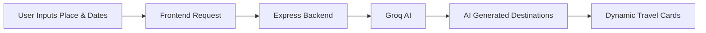

<div align="center">

# 🌍 TRAVERSEHUB

### AI Powered Travel Planning Platform

<p align="center">
  
  
  
  
</p>

<br/>


### ✈️ Smart Travel Discovery with AI

Modern AI-powered travel planner that helps users discover destinations dynamically using Groq AI.

</div>

---

# ✨ Features

<table>
<tr>
<td width="50%">

## 🤖 AI Powered Suggestions
- Smart travel recommendations
- Dynamic destination discovery
- Context-aware AI responses
- Real-time suggestion generation

</td>

<td width="50%">

## 🎨 Modern UI
- Glassmorphism interface
- Fullscreen cinematic background
- Smooth animations
- Responsive design

</td>
</tr>
</table>

---

# 🛠️ Tech Stack

<div align="center">

| Frontend | Backend | AI |
|----------|----------|----|
| React.js | Node.js | Groq API |
| Vite | Express.js | Llama 3 |
| Tailwind CSS | MongoDB | AI Suggestions |
| Framer Motion | REST APIs | Dynamic Prompting |

</div>

---

# 📂 Project Structure

```bash
TraverseHub
│
├── frontend
│   ├── src
│   │   ├── assets
│   │   ├── pages
│   │   ├── components
│   │   └── App.jsx
│   │
│   └── package.json
│
├── backend
│   ├── routes
│   ├── controllers
│   ├── models
│   ├── server.js
│   └── .env
│
└── README.md
```

---

# ⚙️ Installation

## 1️⃣ Clone Repository

```bash
git clone https://github.com/your-username/TraverseHub.git

cd TraverseHub
```

---

## 2️⃣ Frontend Setup

```bash
cd frontend

npm install

npm run dev
```

### Frontend runs on:

```bash
http://localhost:5173
```

---

## 3️⃣ Backend Setup

```bash
cd backend

npm install

npm run dev
```

### Backend runs on:

```bash
http://localhost:5001
```

---

# 🔑 Environment Variables

Copy `Backend/.env.example` to `Backend/.env` and fill it in:

```env
PORT=5001
MONGO_URI=your_mongodb_connection        # required in production (MongoDB Atlas)
JWT_SECRET=long_random_string            # e.g. `openssl rand -hex 32`
GROQ_API_KEY=your_groq_api_key           # optional: AI-written suggestions
CLIENT_URL=http://localhost:5173         # frontend URL(s), comma-separated
GOOGLE_CLIENT_ID=xxx.apps.googleusercontent.com   # optional: "Continue with Google"
```

For the frontend, copy `Frontend/.env.example` to `Frontend/.env` (`VITE_API_URL=http://localhost:5001/api`, and `GOOGLE_CLIENT_ID` with the same Google client ID).

**Continue with Google:** in Google Cloud Console → APIs & Services → Credentials, create an *OAuth client ID* (type: Web application) and add every frontend URL (e.g. `http://localhost:5173` and your Vercel URL) under *Authorized JavaScript origins*. No redirect URI is needed.

In local development, if `MONGO_URI` can't be reached the backend falls back to a temporary in-memory database.

---

# 🚀 Deploying to Vercel

The app deploys as **two Vercel projects from this one repo**:

| Project | Root directory | Environment variables |
|---------|----------------|-----------------------|
| API | `Backend` | `MONGO_URI`, `JWT_SECRET`, `GROQ_API_KEY` (optional), `GOOGLE_CLIENT_ID` (optional), `CLIENT_URL` = the frontend's URL |
| Web | `Frontend` (framework: Vite) | `VITE_API_URL` = the API's URL + `/api`, `GOOGLE_CLIENT_ID` (optional) |

1. Create a free MongoDB Atlas cluster and allow access from anywhere (`0.0.0.0/0`), since Vercel functions don't have fixed IPs.
2. Import the repo in Vercel as the **API** project with root directory `Backend`, add its variables, and deploy. Check `https://<api>.vercel.app/api/health` returns `{"ok":true}`.
3. Import the repo again as the **Web** project with root directory `Frontend`, set `VITE_API_URL`, and deploy.
4. Set the API project's `CLIENT_URL` to the Web URL and redeploy the API (CORS and share links use it).

`Backend/vercel.json` routes every request to the Express app (`api/index.js`); `Frontend/vercel.json` serves `index.html` for all routes so deep links like `/dashboard` and `/t/<code>` work.

---

# 🤖 AI Suggestion Flow



---

# 🔥 API Endpoint

## Generate Travel Suggestions

```http
POST /api/trips/generate
```

### Example Request

```json
{
  "place": "London",
  "startDate": "2026-05-12",
  "endDate": "2026-05-18"
}
```

---

# 🎨 UI Highlights

<div align="center">

| 🌌 Glassmorphism | 🎥 Background Video | ⚡ Smooth Animations |
|------------------|---------------------|----------------------|
| 🤖 AI Suggestions | 🌍 Dynamic Cards | 📱 Responsive Layout |

</div>

---

# 🚀 Future Scope

- 🔐 User Authentication
- 💾 Save Trips
- 🗺️ Interactive Maps
- ✈️ Flight Recommendations
- 🏨 Hotel Suggestions
- 📅 AI Itinerary Generator
- 👥 Collaborative Trip Planning
- 💰 Budget Planner

---

# 👨‍💻 Team

Built with creativity, AI, and hackathon energy.

---

# 📜 License

MIT License

Free to use and modify.

---

<div align="center">


# ⭐ Star the Repository if you like the project

</div>